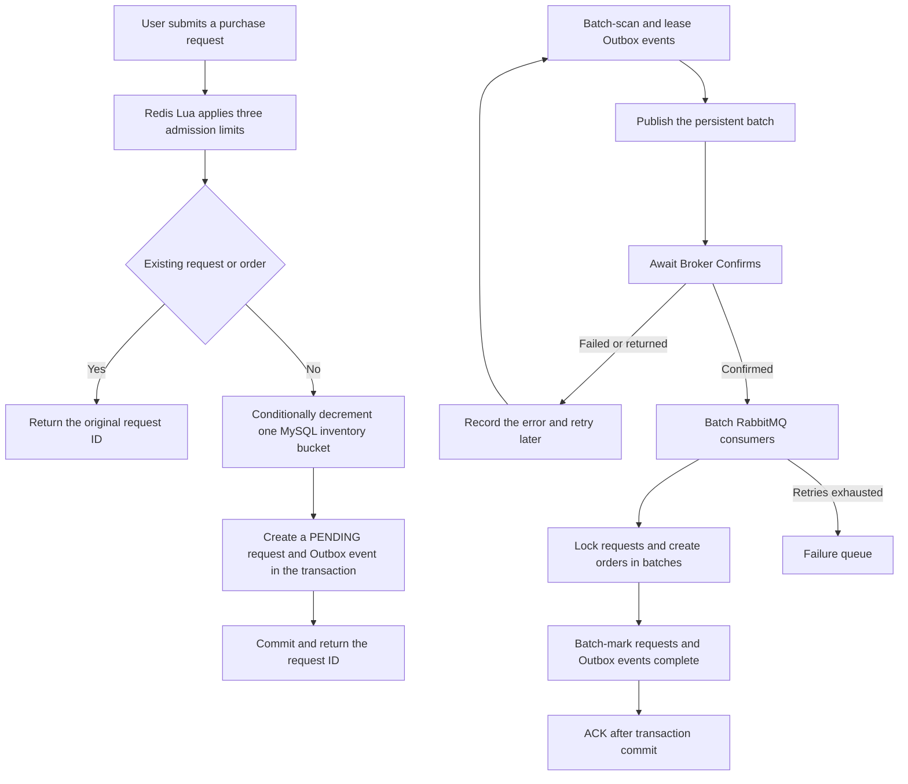

# High-Concurrency Real-Time Event Trading Platform

[Chinese](README.md) | [English](README.en.md)

A high-concurrency transaction backend built with Java 21, Spring Boot, MySQL, Redis, and RabbitMQ. Limited-time purchasing is the core scenario, with emphasis on inventory correctness, request idempotency, admission control, reliable messaging, and asynchronous order consistency.

## Highlights

- **MySQL transaction source of truth:** sixteen inventory buckets spread writes for one voucher, while conditional updates and unique constraints prevent overselling and duplicate orders; Redis does not store final transaction state.
- **Short transactions and overload protection:** idempotency reads occur outside the transaction, while a fair semaphore bounds in-flight database work and returns `429` quickly under overload.
- **Reliable asynchronous orders:** stock reservation, request creation, and the Outbox event commit in one database transaction.
- **Eventual message consistency:** leased Outbox batches, RabbitMQ confirms, persistent messages, transactional batch consumption, a failure queue, and automatic retries cover failure paths.
- **Idempotent requests:** repeating the same purchase returns the original request ID without deducting stock again.
- **Layered admission control:** one Redis `TIME`-based Lua token-bucket call enforces per-user, per-voucher, and global request limits.
- **Observability:** a dedicated management port exposes Prometheus metrics for the connection pool, reservation latency, completion lag, admission rejection, and Outbox backlog.
- **Security boundaries:** token authentication, administrator authorization, atomic code consumption, rate limiting, and request identity cleanup.
- **Automated verification:** 26 default tests, real-infrastructure integration tests, and reproducible k6 write-path load tests.

## Technology Stack

- Java 21 and Spring Boot 3.5
- Spring Security and MyBatis-Plus
- MySQL 8, Redis, and RabbitMQ
- Maven and Docker Compose
- JUnit 5, H2, Mockito, Testcontainers, and k6

## Core Order Workflow



Broker Confirm proves only that RabbitMQ accepted the message. The database Outbox event becomes complete after the consumer transaction succeeds, so duplicate delivery does not create duplicate orders.

## Implemented Features

### Identity and security

- SMS-code login and token authentication.
- Sliding token expiration and explicit logout.
- Administrative endpoint authorization.
- Authentication-code and source-IP rate limiting.
- Image type, size, pixel-count, and owner validation.

### Transactions and consistency

- Vouchers and limited-time purchases.
- Conditional database inventory deduction.
- Sixteen MySQL inventory buckets per voucher to spread row-lock contention.
- Per-user, per-voucher, and global admission control.
- Fair in-flight transaction limits and fast overload rejection.
- Idempotency for each user and voucher pair.
- Order request states: `PENDING` and `COMPLETED`.
- Transactional Outbox batch publishing and scheduled redelivery.
- RabbitMQ persistence, Confirm, Return, concurrent consumption, retries, and failure queue.
- Prometheus metrics for orders, the connection pool, and Outbox state.

### Cache and business features

- Shop caching, null caching, and logical expiration.
- Shop category queries.
- Posts, likes, follows, and check-ins.
- Image upload, retrieval, and deletion.

## Quick Start

### Requirements

- Java 21
- Maven 3.6.3+
- Docker Desktop

### 1. Configure environment variables

Create `.env` in the project root:

```properties
MYSQL_URL=jdbc:mysql://127.0.0.1:3307/event_trading?useSSL=false&serverTimezone=UTC&allowPublicKeyRetrieval=true
MYSQL_USER=root
MYSQL_PASSWORD=replace-with-a-local-password

REDIS_HOST=127.0.0.1
REDIS_PORT=6380

RABBITMQ_HOST=127.0.0.1
RABBITMQ_PORT=5673
RABBITMQ_USER=event_app
RABBITMQ_PASSWORD=replace-with-a-local-password
```

`.env` is ignored by Git. Never commit real credentials.

### 2. Start the infrastructure

```powershell
docker compose up -d
docker compose ps
```

Default ports: MySQL `3307`, Redis `6380`, RabbitMQ `5673`, and RabbitMQ management UI `15673`.

### 3. Start the application

```powershell
mvn test
mvn '-Dspring-boot.run.profiles=local' spring-boot:run
```

The service listens on `http://127.0.0.1:8081`. The `local` profile returns a development verification code and must only be used for local testing.

## Testing

Default tests do not connect to a personal database:

```powershell
mvn test
```

Current default result: **26 tests passed, 0 failed**.

Run isolated integration tests against real MySQL, Redis, and RabbitMQ services:

```powershell
mvn -Pinfrastructure verify
```

## Load Testing

`loadtest/` contains a fixed-arrival-rate test for the real order write path, isolated voucher data, and expiring synthetic user tokens. After preparing the isolated data, run:

```powershell
$env:RATE='1500'
$env:DURATION_SECONDS='10'
$env:VOUCHER_ID='9900021600'
$env:BASE_URL='http://127.0.0.1:8081'
k6 run .\loadtest\order-capacity.js
```

Capacity runs start the application with temporary per-voucher and global limits of `5000`, so protective limits do not hide the system boundary; normal defaults remain `420/s` per voucher and `800/s` globally. Local single-instance environment: Windows 11, Java 21, Docker MySQL 8.4, Redis 7.4, RabbitMQ 4.1, and k6 v2.2.0. Each request calls the authenticated write endpoint with a distinct synthetic user while RabbitMQ consumers run concurrently. Post-run checks cover inventory, request rows, final orders, duplicate orders, and Outbox backlog.

Verified 10-second fixed-arrival-rate results:

- 1000 target RPS: P95 34.69 ms; 10,001 requests and final orders; zero rejection, errors, dropped iterations, duplicate orders, or Outbox backlog.
- 1200 target RPS: P95 12.77 ms; 12,001 requests and final orders; zero rejection, errors, dropped iterations, duplicate orders, or Outbox backlog.
- 1400 target RPS: P95 17.1 ms; 14,001 requests and final orders; zero rejection, errors, dropped iterations, duplicate orders, or Outbox backlog.
- 1500 target RPS: P95 14.82 ms; 15,001 requests and final orders; zero rejection, errors, dropped iterations, duplicate orders, or Outbox backlog.
- 1600 target RPS: P95 109.13 ms; 15,848 of 16,001 requests accepted and 153 received a controlled `429`; no unexpected responses or dropped iterations; every accepted request became one order, with no duplicates or Outbox backlog.

With strict criteria of P95 below one second, zero `429` responses, zero unexpected responses or dropped iterations, no overselling or duplicate orders, and a fully drained Outbox, the demonstrated warm-service level is 1500 target RPS and the failure boundary is between 1500 and 1600 target RPS. This is a 10-second local single-instance baseline, not a production SLA or a 10–30 minute soak result.

## Project Layout

```text
event-trading-platform/
├─ src/main/java/com/eventplatform/
│  ├─ config/          # Security, persistence, and messaging
│  ├─ controller/      # HTTP APIs
│  ├─ order/           # Order transactions and Outbox
│  ├─ security/        # Tokens, codes, and rate limits
│  ├─ service/         # Business logic
│  └─ upload/          # Image storage
├─ src/main/resources/
│  ├─ db/              # Initialization and upgrade scripts
│  └─ mapper/          # MyBatis XML
├─ src/test/           # Unit, regression, and integration tests
├─ docs/               # Architecture and engineering notes
├─ loadtest/           # k6 write-path tests and isolated data
├─ postman/            # API requests
├─ compose.yaml
└─ pom.xml
```

## Runtime Boundaries

- MySQL is the final source of truth for inventory and orders; Redis provides caching, sessions, and admission control.
- Inventory for one voucher is spread across sixteen MySQL row buckets and summed on reads; existing databases migrate through `db/performance-upgrade.sql`.
- The purchase endpoint returns a request ID; the RabbitMQ consumer creates the final order asynchronously.
- Management port `127.0.0.1:8082` exposes only health and Prometheus endpoints.
- The local Compose stack is for development and verification, not a production deployment environment.

## Documentation

- [Security and consistency](docs/SECURITY-FIXES.md)
- [Domain model](docs/architecture/DOMAIN-MODEL.md)
- [Business state machines](docs/architecture/STATE-MACHINES.md)
- [API contract](docs/architecture/API-CONTRACT.md)
