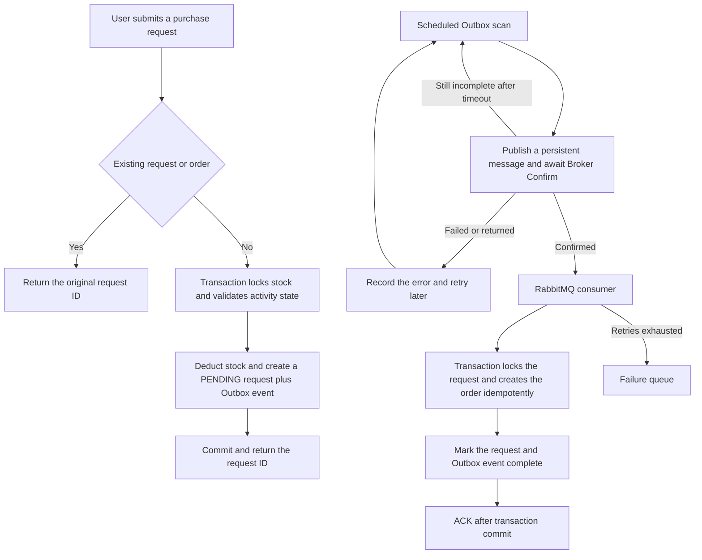

# High-Concurrency Real-Time Event Trading Platform

[Chinese](README.md) | [English](README.en.md)

A high-concurrency transaction backend built with Java 21, Spring Boot, MySQL, Redis, and RabbitMQ.
The project uses limited-time purchasing as its core scenario and focuses on inventory correctness, duplicate-request handling, reliable messaging, and asynchronous order consistency.

> The current version provides a runnable voucher-purchase workflow. Complete event, session, payment, and refund domains are still being developed and are explicitly marked **(Not implemented)**.

## Highlights

- **Database as the transaction source of truth:** conditional stock updates and row locks prevent overselling without treating Redis as final transaction state.
- **Reliable asynchronous orders:** stock reservation, request creation, and the Outbox event commit in one database transaction.
- **Eventual message consistency:** RabbitMQ confirms, persistent messages, idempotent consumption, a failure queue, and Outbox retries cover failure paths.
- **Idempotent requests:** repeating the same purchase returns the original request ID without deducting stock again.
- **Security boundaries:** token authentication, administrator authorization, atomic code consumption, rate limiting, and request identity cleanup.
- **Cache protection:** null caching, logical expiration, asynchronous refresh, lock ownership verification, and post-commit invalidation.
- **Automated verification:** 22 default tests plus Testcontainers-based infrastructure integration tests.

## Technology Stack

- Java 21 and Spring Boot 3.5
- Spring Security and MyBatis-Plus
- MySQL 8, Redis, and RabbitMQ
- Maven and Docker Compose
- JUnit 5, H2, Mockito, and Testcontainers

## Core Order Workflow



Broker Confirm proves only that RabbitMQ accepted the message. The database Outbox event becomes complete only after the consumer transaction succeeds, so duplicate delivery does not create duplicate orders.

## Implemented Features

### Identity and security

- SMS-code login and token authentication.
- Sliding token expiration and explicit logout.
- Administrative endpoint authorization.
- Authentication-code and source-IP rate limiting.
- Image type, size, pixel-count, and owner validation.

### Transactions and consistency

- Vouchers and limited-time purchases.
- Conditional database stock deduction.
- Duplicate-request protection per user and resource.
- Order request states: `PENDING` and `COMPLETED`.
- Transactional Outbox with scheduled redelivery.
- RabbitMQ persistence, Confirm, Return, consumer retry, and failure queue.

### Cache and transitional features

- Shop caching, null caching, and logical expiration.
- Shop category queries.
- Posts, likes, follows, and check-ins.
- Image upload, retrieval, and deletion.

The shop, post, follow, and check-in features are transitional and will be removed as the event-trading domain is implemented.

## Roadmap

- Event, session, product, and ticket-tier models **(Not implemented)**.
- Event publishing and lifecycle management **(Not implemented)**.
- Payments, callbacks, and timeout closing **(Not implemented)**.
- Order cancellation, refunds, and stock compensation **(Not implemented)**.
- WebSocket or SSE notifications **(Not implemented)**.
- Metrics, distributed tracing, and automated alerts **(Not implemented)**.
- Reproducible load-test scripts and performance reports **(Not implemented)**.
- Production deployment orchestration **(Not implemented)**.

## Quick Start

### Requirements

- Java 21
- Maven 3.6.3+
- Docker Desktop

### 1. Configure environment variables

Create `.env` in the project root:

```properties
MYSQL_URL=jdbc:mysql://127.0.0.1:3307/event_trading?useSSL=false&serverTimezone=UTC&allowPublicKeyRetrieval=true
MYSQL_USER=root
MYSQL_PASSWORD=replace-with-a-local-password

REDIS_HOST=127.0.0.1
REDIS_PORT=6380

RABBITMQ_HOST=127.0.0.1
RABBITMQ_PORT=5673
RABBITMQ_USER=event_app
RABBITMQ_PASSWORD=replace-with-a-local-password
```

`.env` is ignored by Git. Never commit real credentials.

### 2. Start the infrastructure

```powershell
docker compose up -d
docker compose ps
```

Default ports: MySQL `3307`, Redis `6380`, RabbitMQ `5673`, and RabbitMQ management UI `15673`.

### 3. Start the application

```powershell
mvn test
mvn '-Dspring-boot.run.profiles=local' spring-boot:run
```

The service listens on `http://127.0.0.1:8081`.

The `local` profile returns a development verification code and must never be exposed publicly.

### 4. Verify login

```powershell
$phone = '13900000001'
$sent = Invoke-RestMethod -Method Post "http://127.0.0.1:8081/user/code?phone=$phone"
$body = @{ phone=$phone; code=$sent.data.developmentCode } | ConvertTo-Json
$login = Invoke-RestMethod -Method Post 'http://127.0.0.1:8081/user/login' -ContentType 'application/json' -Body $body
$headers = @{ authorization=$login.data }
Invoke-RestMethod 'http://127.0.0.1:8081/user/me' -Headers $headers
```

## Testing

Default tests do not connect to a personal database:

```powershell
mvn test
```

Current default result: **22 tests passed, 0 failed**.

Run isolated integration tests against real MySQL, Redis, and RabbitMQ services:

```powershell
mvn -Pinfrastructure verify
```

Docker is required. Infrastructure integration testing is not a substitute for performance testing.

## Project Layout

```text
event-trading-platform/
├─ src/main/java/com/eventplatform/
│  ├─ config/          # Security, persistence, and messaging
│  ├─ controller/      # HTTP APIs
│  ├─ order/           # Order transactions and Outbox
│  ├─ security/        # Tokens, codes, and rate limits
│  ├─ service/         # Business logic
│  └─ upload/          # Image storage
├─ src/main/resources/
│  ├─ db/              # Initialization and upgrade scripts
│  └─ mapper/          # MyBatis XML
├─ src/test/           # Unit, regression, and integration tests
├─ docs/               # Requirements and engineering notes
├─ postman/            # API requests
├─ compose.yaml
└─ pom.xml
```

## Design Boundaries

- The current implementation prioritizes correctness and does not claim production-grade throughput.
- Hot inventory serializes at the relevant database row lock.
- The purchase endpoint returns a request ID, not a guarantee that the final order already exists.
- Payment, refunds, and automatic stock release are not implemented; never increase stock manually while order state is uncertain.
- The local Compose stack is for development and is not a production deployment design.

## Documentation

- [Project goals and acceptance requirements](docs/PROJECT-REQUIREMENTS.md)
- [Security and consistency changes](docs/SECURITY-FIXES.md)

When a roadmap item is completed, add its implementation and tests, then remove the corresponding marker from both README versions.
