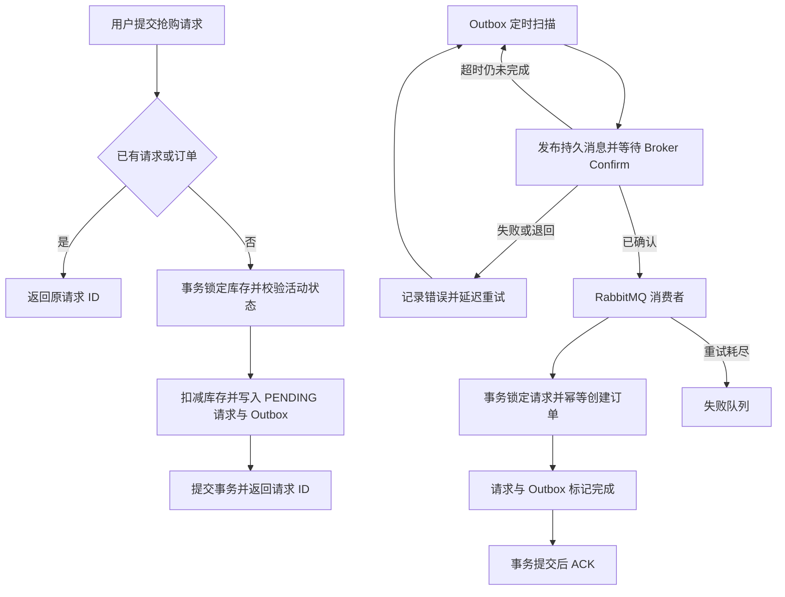

# 高并发实时活动与交易平台

[简体中文](README.md) | [English](README.en.md)

基于 Java 21、Spring Boot、MySQL、Redis 和 RabbitMQ 构建的高并发交易后端。
项目以限时抢购为核心场景，重点解决库存正确性、重复请求、可靠消息投递和异步订单一致性问题。

> 当前版本已经完成可运行的优惠券抢购链路；活动、场次、支付和退款等完整交易领域仍在重构中，未完成能力均明确标记为“（未实现）”。

## 项目亮点

- **数据库作为交易事实源**：库存条件扣减与行锁共同避免超卖，不依赖 Redis 保存最终交易状态。
- **可靠异步订单**：库存预留、请求记录和 Outbox 事件在同一事务中提交。
- **消息最终一致性**：RabbitMQ Confirm、持久化消息、消费端幂等、失败队列和 Outbox 重试共同处理异常。
- **请求幂等**：同一用户重复提交同一抢购请求时返回同一个请求 ID，不重复扣减库存。
- **安全边界**：Token 鉴权、管理员权限、验证码原子消费、接口限流和请求结束身份清理。
- **缓存治理**：支持空值缓存、逻辑过期、异步刷新、锁所有权校验和事务提交后失效。
- **自动化验证**：包含 22 项默认测试，以及基于 Testcontainers 的真实基础设施集成测试。

## 技术栈

- Java 21、Spring Boot 3.5
- Spring Security、MyBatis-Plus
- MySQL 8、Redis、RabbitMQ
- Maven、Docker Compose
- JUnit 5、H2、Mockito、Testcontainers

## 核心订单链路



Broker Confirm 只代表消息已被 RabbitMQ 接收。只有消费者事务完成后，数据库中的 Outbox 事件才会被标记为完成；因此即使发生重复投递，也不会重复创建订单。

## 已实现功能

### 账户与安全

- 手机验证码登录和 Token 鉴权。
- Token 滑动过期及主动登出。
- 管理接口角色校验。
- 验证码发送、校验和来源 IP 限流。
- 图片类型、大小、像素及所有者校验。

### 交易与一致性

- 优惠券及限时抢购。
- 数据库条件扣减库存。
- 用户与资源维度的重复请求保护。
- 订单请求状态查询：`PENDING`、`COMPLETED`。
- Transactional Outbox 及定时补发。
- RabbitMQ 持久化、Confirm、Return、消费重试和失败队列。

### 缓存与现有业务

- 商户查询缓存、空值缓存和逻辑过期。
- 商户分类查询。
- 笔记、点赞、关注和签到。
- 图片上传、读取和删除。

现有商户、笔记、关注和签到代码属于过渡业务，后续将随活动交易领域落地逐步移除。

## 计划功能

- 活动、场次、商品和票档模型（未实现）。
- 活动发布、上下架和状态流转（未实现）。
- 支付、支付回调和超时关单（未实现）。
- 取消订单、退款和库存补偿（未实现）。
- WebSocket 或 SSE 实时通知（未实现）。
- 监控指标、链路追踪和自动告警（未实现）。
- 可复现的并发压测脚本和性能报告（未实现）。
- 生产环境部署编排（未实现）。

## 快速启动

### 环境要求

- Java 21
- Maven 3.6.3+
- Docker Desktop

### 1. 配置环境变量

在项目根目录创建 `.env`：

```properties
MYSQL_URL=jdbc:mysql://127.0.0.1:3307/event_trading?useSSL=false&serverTimezone=UTC&allowPublicKeyRetrieval=true
MYSQL_USER=root
MYSQL_PASSWORD=替换为本地密码

REDIS_HOST=127.0.0.1
REDIS_PORT=6380

RABBITMQ_HOST=127.0.0.1
RABBITMQ_PORT=5673
RABBITMQ_USER=event_app
RABBITMQ_PASSWORD=替换为本地密码
```

`.env` 已被 Git 忽略，请勿提交真实凭据。

### 2. 启动基础设施

```powershell
docker compose up -d
docker compose ps
```

默认端口：MySQL `3307`、Redis `6380`、RabbitMQ `5673`、RabbitMQ 管理界面 `15673`。

### 3. 启动应用

```powershell
mvn test
mvn '-Dspring-boot.run.profiles=local' spring-boot:run
```

服务地址：`http://127.0.0.1:8081`。

`local` profile 会返回开发验证码，只能用于本机调试，禁止暴露到公网。

### 4. 验证登录

```powershell
$phone = '13900000001'
$sent = Invoke-RestMethod -Method Post "http://127.0.0.1:8081/user/code?phone=$phone"
$body = @{ phone=$phone; code=$sent.data.developmentCode } | ConvertTo-Json
$login = Invoke-RestMethod -Method Post 'http://127.0.0.1:8081/user/login' -ContentType 'application/json' -Body $body
$headers = @{ authorization=$login.data }
Invoke-RestMethod 'http://127.0.0.1:8081/user/me' -Headers $headers
```

## 测试

默认测试不连接个人数据库：

```powershell
mvn test
```

当前默认测试结果：**22 项通过，0 失败**。

使用真实 MySQL、Redis 和 RabbitMQ 运行隔离集成测试：

```powershell
mvn -Pinfrastructure verify
```

该命令需要 Docker；它与性能压测不是同一种检查。

## 项目结构

```text
event-trading-platform/
├─ src/main/java/com/eventplatform/
│  ├─ config/          # 安全、数据库和消息配置
│  ├─ controller/      # HTTP API
│  ├─ order/           # 订单事务与 Outbox
│  ├─ security/        # Token、验证码和限流
│  ├─ service/         # 业务逻辑
│  └─ upload/          # 图片存储
├─ src/main/resources/
│  ├─ db/              # 建库及升级脚本
│  └─ mapper/          # MyBatis XML
├─ src/test/           # 单元、回归和集成测试
├─ docs/               # 需求与技术说明
├─ postman/            # API 请求集合
├─ compose.yaml
└─ pom.xml
```

## 设计边界

- 当前实现优先保证一致性，没有宣称达到生产级吞吐量。
- 热点库存会在数据库行锁位置串行化。
- 抢购接口返回的是请求 ID，不代表订单已经完成落库。
- 当前未实现支付、退款和库存自动释放，订单状态不明确时不能手工增加库存。
- 本地 Compose 仅用于开发，不代表生产部署方案。

## 相关文档

- [项目目标与验收要求](docs/PROJECT-REQUIREMENTS.md)
- [安全及一致性改造说明](docs/SECURITY-FIXES.md)
- [领域模型](docs/architecture/DOMAIN-MODEL.md)
- [业务状态机](docs/architecture/STATE-MACHINES.md)
- [API 契约](docs/architecture/API-CONTRACT.md)

每完成一项计划功能，应同步补充实现和测试，并删除中英文 README 中对应的“未实现”标记。
