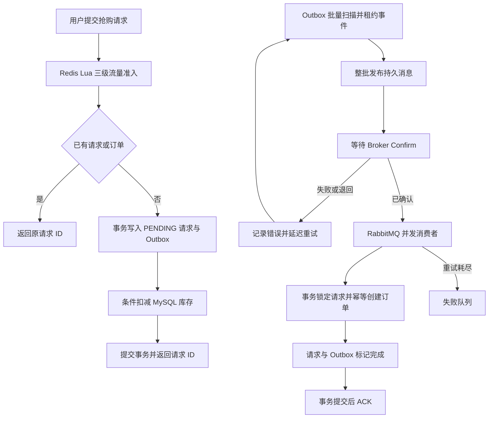

# 高并发实时活动与交易平台

[简体中文](README.md) | [English](README.en.md)

基于 Java 21、Spring Boot、MySQL、Redis 和 RabbitMQ 构建的高并发交易后端。项目以限时抢购为核心场景，重点解决库存正确性、重复请求、流量保护、可靠消息投递和异步订单一致性问题。

## 项目亮点

- **MySQL 交易事实源**：条件扣减库存，使用唯一约束防止同一用户重复下单，Redis 不保存最终交易状态。
- **短事务热点控制**：幂等查询位于事务外，库存条件更新在事务末尾执行，缩短热点库存行的持锁时间。
- **可靠异步订单**：库存预留、请求记录和 Outbox 事件在同一事务中提交。
- **消息最终一致性**：RabbitMQ Confirm、持久化消息、消费端幂等、失败队列和 Outbox 重试覆盖异常路径。
- **请求幂等**：同一用户重复提交同一抢购请求时返回同一个请求 ID，不重复扣减库存。
- **分层流量控制**：一次 Redis Lua 调用完成用户、单商品和全局三级准入检查。
- **安全边界**：Token 鉴权、管理员权限、验证码原子消费、接口限流和请求结束身份清理。
- **自动化验证**：包含 24 项默认测试、真实依赖集成测试和可复现的 k6 写链路压测。

## 技术栈

- Java 21、Spring Boot 3.5
- Spring Security、MyBatis-Plus
- MySQL 8、Redis、RabbitMQ
- Maven、Docker Compose
- JUnit 5、H2、Mockito、Testcontainers、k6

## 核心订单链路



Broker Confirm 只代表 RabbitMQ 已接收消息。消费者事务完成后，数据库中的 Outbox 事件才会被标记为完成；重复投递不会重复创建订单。

## 已实现功能

### 账户与安全

- 手机验证码登录和 Token 鉴权。
- Token 滑动过期及主动登出。
- 管理接口角色校验。
- 验证码发送、校验和来源 IP 限流。
- 图片类型、大小、像素及所有者校验。

### 交易与一致性

- 优惠券及限时抢购。
- 数据库条件扣减库存。
- 用户、单商品和全局三级流量准入。
- 同一用户、同一优惠券的请求幂等。
- 订单请求状态查询：`PENDING`、`COMPLETED`。
- Transactional Outbox 批量发布和定时补发。
- RabbitMQ 持久化、Confirm、Return、并发消费、重试和失败队列。

### 缓存与业务功能

- 商户查询缓存、空值缓存和逻辑过期。
- 商户分类查询。
- 笔记、点赞、关注和签到。
- 图片上传、读取和删除。

## 快速启动

### 环境要求

- Java 21
- Maven 3.6.3+
- Docker Desktop

### 1. 配置环境变量

在项目根目录创建 `.env`：

```properties
MYSQL_URL=jdbc:mysql://127.0.0.1:3307/event_trading?useSSL=false&serverTimezone=UTC&allowPublicKeyRetrieval=true
MYSQL_USER=root
MYSQL_PASSWORD=替换为本地密码

REDIS_HOST=127.0.0.1
REDIS_PORT=6380

RABBITMQ_HOST=127.0.0.1
RABBITMQ_PORT=5673
RABBITMQ_USER=event_app
RABBITMQ_PASSWORD=替换为本地密码
```

`.env` 已被 Git 忽略，请勿提交真实凭据。

### 2. 启动基础设施

```powershell
docker compose up -d
docker compose ps
```

默认端口：MySQL `3307`、Redis `6380`、RabbitMQ `5673`、RabbitMQ 管理界面 `15673`。

### 3. 启动应用

```powershell
mvn test
mvn '-Dspring-boot.run.profiles=local' spring-boot:run
```

服务地址：`http://127.0.0.1:8081`。`local` profile 会返回开发验证码，只能用于本机调试。

## 测试

默认测试不连接个人数据库：

```powershell
mvn test
```

当前默认测试结果：**24 项通过，0 失败**。

使用真实 MySQL、Redis 和 RabbitMQ 运行隔离集成测试：

```powershell
mvn -Pinfrastructure verify
```

## 并发压测

`loadtest/` 包含真实下单固定到达率脚本、隔离优惠券数据和自动过期的合成用户令牌。准备隔离数据后可执行：

```powershell
$env:RATE='415'
$env:DURATION_SECONDS='10'
$env:VOUCHER_ID='9900010415'
$env:BASE_URL='http://127.0.0.1:8081'
k6 run .\loadtest\order-capacity.js
```

本地单实例测试环境：Windows 11、Java 21、Docker MySQL 8.4、Redis 7.4、RabbitMQ 4.1、k6 v2.2.0。每次请求调用真实鉴权下单接口并使用不同合成用户；测试后核对库存、请求、最终订单、重复订单和 Outbox。

10 秒固定到达率结果：

- 400 目标 RPS：P95 336.31 ms，0 非预期响应，0 dropped iterations。
- 410 目标 RPS：P95 587.7 ms，0 非预期响应，0 dropped iterations。
- 415 目标 RPS：P95 714.23 ms，4150 个请求全部成功，库存 0、最终订单 4150、重复订单 0、Outbox 积压 0。
- 425 目标 RPS：P95 912.92 ms，出现 1 次数据库连接池超时。
- 450 目标 RPS：P95 1.94 s，102 个 dropped iterations、4 次数据库连接池超时。

按 P95 小于 1 秒、无非预期响应、无 dropped iteration 和数据一致性校验的口径，当前已验证稳定档位为 415 目标 RPS，失败边界位于 415～425 目标 RPS。该结果是本地单实例、10 秒短时容量基线，不代表生产环境 SLA。

## 项目结构

```text
event-trading-platform/
├─ src/main/java/com/eventplatform/
│  ├─ config/          # 安全、数据库和消息配置
│  ├─ controller/      # HTTP API
│  ├─ order/           # 订单事务与 Outbox
│  ├─ security/        # Token、验证码和限流
│  ├─ service/         # 业务逻辑
│  └─ upload/          # 图片存储
├─ src/main/resources/
│  ├─ db/              # 建库及升级脚本
│  └─ mapper/          # MyBatis XML
├─ src/test/           # 单元、回归和集成测试
├─ docs/               # 架构与技术说明
├─ loadtest/           # k6 写链路压测与隔离数据
├─ postman/            # API 请求集合
├─ compose.yaml
└─ pom.xml
```

## 运行边界

- MySQL 是库存和订单的最终事实源；Redis 用于缓存、会话和流量准入。
- 同一商品的库存更新仍会在单条 MySQL 记录上串行化。
- 抢购接口返回请求 ID，最终订单由 RabbitMQ 消费者异步创建。
- 本地 Compose 用于开发和验证，不代表生产部署环境。

## 相关文档

- [安全及一致性说明](docs/SECURITY-FIXES.md)
- [领域模型](docs/architecture/DOMAIN-MODEL.md)
- [业务状态机](docs/architecture/STATE-MACHINES.md)
- [API 契约](docs/architecture/API-CONTRACT.md)
