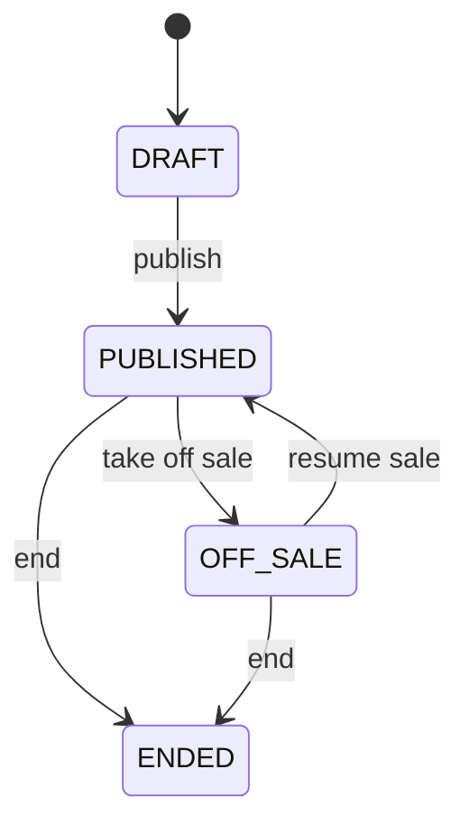
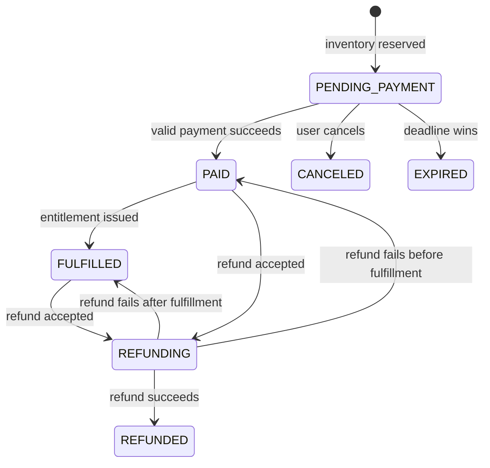
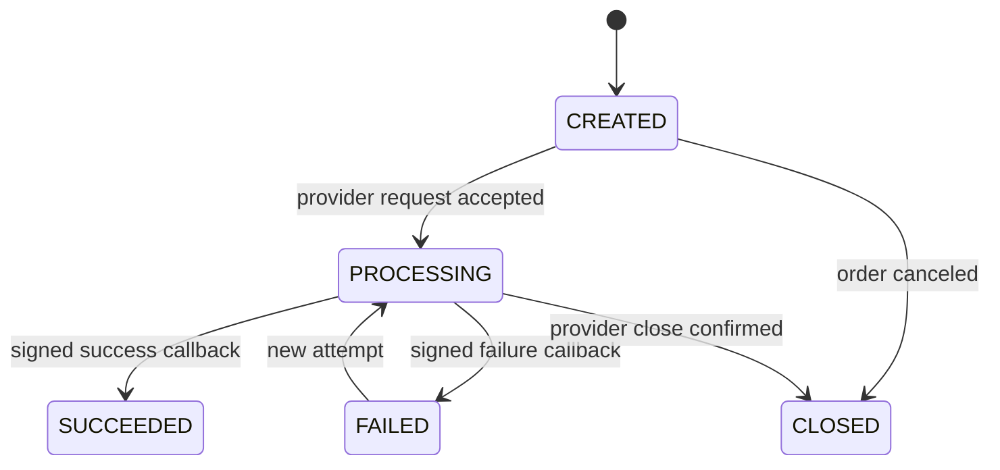
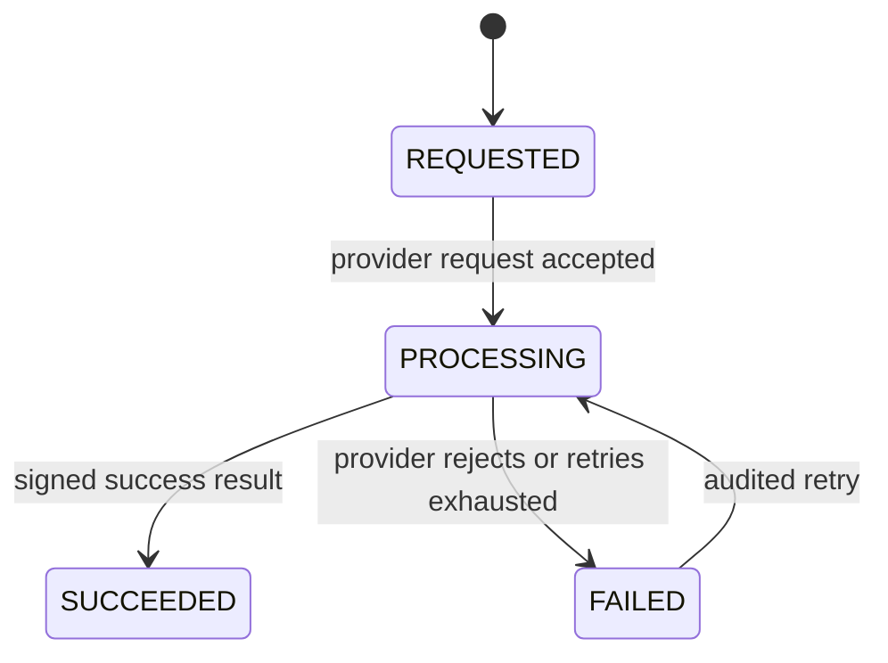
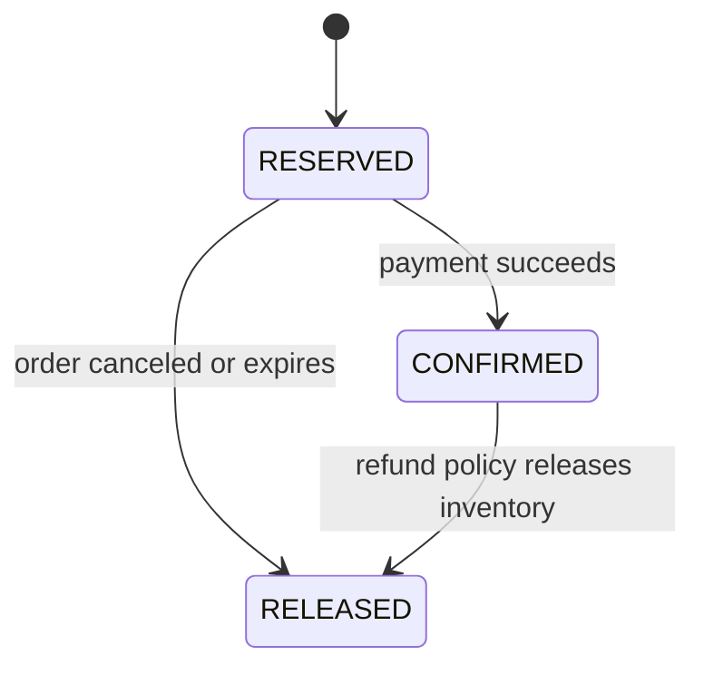

# State Machines

## General Rules

- State transitions are commands, not arbitrary field updates.
- Every transition verifies the current state with a conditional update or row lock.
- Repeating a completed transition is a no-op that returns the committed result.
- An invalid transition returns `409 Conflict` with a stable business error code.
- State, state history, and the outgoing Outbox event change in one transaction.
- Consumers and callbacks may arrive more than once or out of order.

## Event

- Publishing requires at least one valid session and ticket tier.
- Resuming requires a future sellable session.
- `ENDED` is terminal; published events cannot be deleted.

## Order

Rules:

- `PENDING_PAYMENT` owns a `RESERVED` inventory reservation.
- `PAID` and `FULFILLED` own a `CONFIRMED` reservation.
- `CANCELED` and `EXPIRED` own a `RELEASED` reservation.
- A late payment for `CANCELED` or `EXPIRED` never reopens the order. It creates a compensating refund and a reconciliation record.
- Timeout and payment processing compete on the same guarded transition; exactly one wins.
- A refund failure returns the order to the state captured when the refund started.
- `CANCELED`, `EXPIRED`, and `REFUNDED` are terminal.

## Payment

Rules:

- `SUCCEEDED` is immutable; refunds are separate aggregates.
- Duplicate callbacks with the same provider transaction and payload are acknowledged without repeated effects.
- Conflicting amount, currency, order, or payload is rejected and audited.
- Unknown callbacks are stored for reconciliation instead of discarded.
- Payment success updates payment, order, reservation, history, and Outbox records atomically.

## Refund

Rules:

- `SUCCEEDED` is terminal.
- Duplicate requests return the refund identified by `(paymentId, idempotencyKey)`.
- Success transitions the order to `REFUNDED` and emits `RefundSucceeded` in one transaction.
- Inventory release cannot increase available inventory more than once.
- Automatic retries are bounded; exhausted failures require an audited operator action.

## Inventory Reservation

- Every transition is guarded by the previous state.
- Releasing an already released reservation is a no-op.
- Inventory counters and reservation state change in one transaction.
- Reconciliation calculates expected counters from reservations and reports discrepancies before repair.

## Race Resolution

### Payment callback versus timeout or cancellation

1. Both operations require `PENDING_PAYMENT`.
2. Both lock or conditionally update the same order.
3. The first committed transition wins.
4. If cancellation or timeout wins, later payment success triggers a compensating refund.
5. If payment wins, cancellation or timeout performs no state change.

### Duplicate or out-of-order messages

Consumers claim `(consumerName, messageId)` in the Inbox table in the same transaction as the business effect. Completed messages are acknowledged as duplicates. Valid but premature messages remain retryable or enter reconciliation; they never force an illegal transition.
